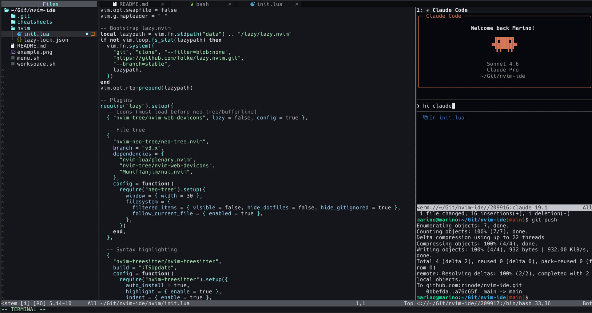

# tui-ide

A self-contained terminal workspace: Neovim + Claude Code, configured from a single repo.



## Requirements

- nvim >= 0.11
- claude (Claude Code CLI)
- fzf >= 0.27
- curl, unzip (for font install)

## Setup

```bash
git clone <repo> ~/tui-ide
cd ~/tui-ide
./workspace.sh [project-dir]
```

If no `project-dir` is given, the current directory is used.

On first run, JetBrainsMono Nerd Font is installed automatically. Set it as your terminal font to get file icons in Neovim.

On first Neovim launch, lazy.nvim bootstraps itself and installs all plugins. Mason installs the configured LSP servers (TypeScript, PHP) in the background.

## Reference menu

Press `<leader>/` to open a searchable reference menu. Select a list and type to filter.

Available lists:

- Vim cheat sheet
- Git cheat sheet
- Claude Code cheat sheet

To add a new list, create a file in `cheatsheets/` and add an entry to the `MENUS` array in `menu.sh`.

## Layout

On startup, the workspace opens with three panes:

```
┌──────────┬─────────────────┬─────────────┐
│          │                 │ Claude Code │
│ neo-tree │     editor      ├─────────────┤
│          │                 │    bash     │
└──────────┴─────────────────┴─────────────┘
```

Navigate between panes with `Ctrl+w h/j/k/l` (or `Ctrl+w w` to cycle). To navigate out of a terminal, press `Ctrl+\ Ctrl+n` first to exit insert mode.

## Neovim keybindings

| Key | Action |
|-----|--------|
| `Space` | Leader key |
| `<leader>e` | Toggle file tree |
| `<leader>x` | Close buffer |
| `<leader>/` | Open reference menu |
| `Shift+L` | Next buffer |
| `Shift+H` | Previous buffer |
| `gd` | Go to definition |
| `gr` | Show references |
| `K` | Hover docs |
| `<leader>rn` | Rename symbol |
| `<leader>ca` | Code action |
| `<leader>f` | Format file |

### Claude Code (`<leader>a`)

| Key | Action |
|-----|--------|
| `<leader>ac` | Toggle Claude terminal |
| `<leader>af` | Focus Claude terminal |
| `<leader>ar` | Resume last session |
| `<leader>aC` | Continue last session |
| `<leader>am` | Select model |
| `<leader>ab` | Add current buffer to context |
| `<leader>as` | Send visual selection to Claude |
| `<leader>as` | Add file (in neo-tree) |
| `<leader>aa` | Accept diff |
| `<leader>ad` | Deny diff |

## Customization

- **Neovim config**: `nvim/init.lua`
- **LSP servers**: edit `ensure_installed` in `nvim/init.lua`
- **Cheat sheets**: plain text files in `cheatsheets/`
